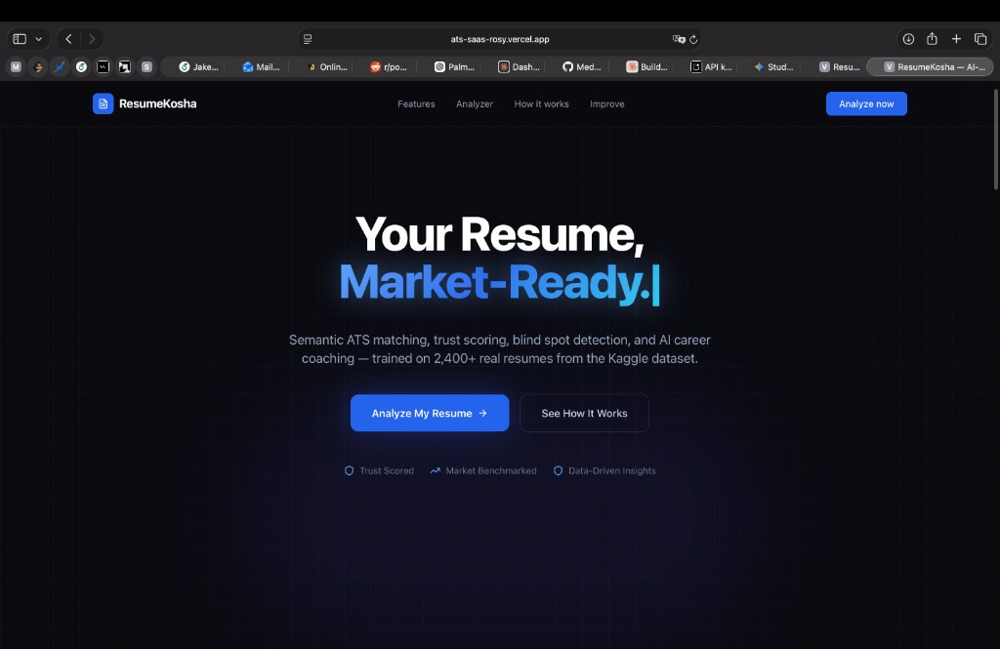

# ResumeKosha (ATS + Resume Intelligence SaaS)

ResumeKosha is a production-ready Next.js app that analyzes uploaded PDF resumes against market benchmark data, then provides ATS scoring, blind-spot detection, rewrite guidance, and interactive AI coaching.

## Live Deployment

- Production URL: [https://ats-saas-rosy.vercel.app](https://ats-saas-rosy.vercel.app)

## Project Screenshot



## What It Does

- Upload a PDF resume and parse text safely on the server.
- Run multi-stage ATS and market-fit analysis using Gemini (with resilient fallback output).
- Compare resume signals against backend benchmark resume data from `data/Resume.csv`.
- Identify missing critical skills and explain why they matter in market context.
- Detect weak bullets and power an interactive AI coach to rewrite them with stronger impact.
- Generate improvement guidance across impact, skill gaps, section balance, and fluff reduction.
- Simulate ATS extraction preview to catch formatting/parsing risk before applications.
- Send analysis reports via email endpoint with graceful fallback behavior.

## Core Stack

- `Next.js 14` (App Router) + `TypeScript`
- `Tailwind CSS` + `Framer Motion`
- `Google Gemini API`
- `pdf-parse` for PDF text extraction
- `csv-parse` for backend resume dataset loading
- `nodemailer` for report delivery

## Security & Reliability

- API rate limiting on analysis/chat/report endpoints.
- Origin checks and security headers in middleware.
- Server-side validation for file type, file size, and required inputs.
- Node runtime enforced for PDF parsing route to avoid edge-runtime incompatibilities.
- Timeout and model fallback behavior for AI calls.
- Structured fallback JSON so UI remains stable even when external AI fails.

## Local Development

1. Install dependencies:

```bash
npm install
```

2. Create `.env.local`:

```bash
GEMINI_API_KEY=your_gemini_api_key
SMTP_HOST=your_smtp_host
SMTP_PORT=587
SMTP_USER=your_smtp_user
SMTP_PASS=your_smtp_pass
SMTP_FROM=your_from_email
```

3. Run locally:

```bash
npm run dev
```

4. Open `http://localhost:3000`

## API Endpoints

- `POST /api/analyze` - PDF resume analysis + ATS intelligence.
- `POST /api/chat-coach` - interactive context-aware coach Q&A.
- `POST /api/send-report` - sends formatted report email.

## Repository Notes

- Resume benchmark data is loaded from `data/Resume.csv`.
- Main landing page is in `app/page.tsx`.
- Analyzer UI is in `components/sections/AnalyzerSection.tsx`.
- Analysis engine is in `app/api/analyze/route.ts`.
- AI coach backend is in `app/api/chat-coach/route.ts`.
